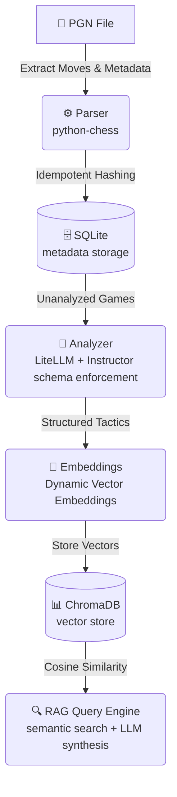

# ♞ Chess Analyst

```text
      (\=,
     //  .\
    (( \_  \
     ))  `\_)
    (/     \
     | _.-'|
      )___(
     (=====)
    }======={
   /         \
  |___________|
```


Chess Analyst is a highly structured, locally-hosted 5-module ETL pipeline and RAG (Retrieval-Augmented Generation) query engine designed to extract deep analytical insights from historical chess data.

Rather than acting as a simple API wrapper, this project parses raw PGN files, enforces rigorous JSON schema validation on LLMs (via `instructor` and `litellm`), generates vector embeddings, and synthesizes tactical patterns using a robust retrieval pipeline over ChromaDB with a cosine similarity search process. It effectively transforms thousands of forgotten, unstructured games into queryable, relational metadata stored in an idempotent SQLite framework and rendered locally in your terminal via the `click` CLI.

---

## 🏗️ System Architecture

The pipeline securely handles data extraction, vector mapping, and semantic search locally, reaching out to your LLM of choice strictly for raw inference and embedding projections.



### 🔑 Key Architectural Insights

- **Multi-Model Agnostic:** Powered by `litellm` and `instructor`, the system natively supports structured extraction across major providers (OpenAI, Anthropic, Google, xAI), allowing for model-agnostic inference.
- **Pydantic Schema Enforcement:** The `analyzer` module forces the AI to respond strictly within a Pydantic-defined JSON schema. This ensures highly reliable downstream ETL parsing and eliminates hallucinated output structures.
- **Analytical Precision:** Inference operates at `temperature=0.2`. Because chess analysis is a highly objective, logical task, reducing the creativity parameter guarantees precision on complex tactical sequences.
- **Idempotent Data Ingestion:** The `parser` generates a unique cryptographic hash of each game's headers. This guarantees that duplicate or overlapping PGN histories can be ingested flawlessly without creating duplicate database records or wasting token inference limits.

---

## 🛠️ Tech Stack

This project is built using:
- **Language**: Python 3.12+ (managed via `uv`)
- **CLI**: `click` for command routing and `rich` for formatting.
- **Inference**: `litellm` and `instructor` for schema validation.
- **Database**: Local `sqlite3` for metadata and `ChromaDB` for vector retrieval.
- **Testing**: `pytest` using mocked API intercepts.

---

## 💡 Example Output

Here's an example terminal output when querying the RAG engine against analyzed games:

```
Querying history for: can you tell me my blunders from all the games you analyzed so far


╭────────────────────────────────────────────── 🧠 AI Playstyle Analysis ──────────────────────────────────────────────╮
│ Based on the games analyzed so far, your blunders tend to fall into two main categories: direct tactical oversights  │
│ leading to immediate material loss and strategic missteps that severely compromise king safety, setting the stage    │
│ for later tactical collapses.                                                                                        │
│                                                                                                                      │
│ Here's a breakdown of your blunders:                                                                                 │
│                                                                                                                      │
│ Direct Tactical Blunders (Hanging Pieces & Miscalculations)                                                          │
│                                                                                                                      │
│  1 Game 9dace6c57af9c09a (Middlegame, Move 12. Qg4): This was a game-losing blunder where you moved your queen to    │
│    g4, leaving it completely undefended and allowing Black's bishop on e5 to capture it immediately. This is a       │
│    fundamental oversight of a hanging piece.                                                                         │
│  2 Game 8e62ba4b1488069e (Middlegame, Move 18. Nxe5): This was a critical blunder where you attempted to win a pawn  │
│    but completely miscalculated Black's response. This move opened the d-file for Black's rook, leading to a strong  │
│    counter-attack and a lost position.                                                                               │
│                                                                                                                      │
│ Recurring Theme: Tactical Blind Spots Under Pressure A clear pattern here is the occurrence of blunders that involve │
│ either directly hanging a piece (like the queen on g4) or miscalculating a tactical sequence, especially when your   │
│ king is already under pressure or your position is becoming difficult.                                               │
│                                                                                                                      │
│ Constructive Advice:                                                                                                 │
│                                                                                                                      │
│  • "Blunder Check" Routine: Before making any move, especially in complex or tense positions, ask yourself:          │
│     • "Is any of my pieces hanging?"                                                                                 │
│     • "Is my king safe after this move?"                                                                             │
│     • "What is my opponent's best response, and what are its consequences?"                                          │
│  • Prioritize King Safety: Be very cautious about pushing pawns directly in front of your castled king               │
│    unless you have a very clear and calculated reason.                                                               │
╰──────────────────────────────────────────────────────────────────────────────────────────────────────────────────────╯

Sources used for this analysis:
- Game ID: 9dace6c57af9c09a (Unknown)
- Game ID: 8e62ba4b1488069e (Unknown)
```

---

## 🚀 Quick Setup

> [!NOTE]
> The system defaults to Google's Gemini models, but supports an agnostic `litellm` interface. You will need to generate API keys for the providers you wish to use.

1. **Install dependencies**: Open your terminal here and install the environment via `uv`:
    ```bash
    uv sync
    ```
2. **Interactive Setup**: Run the setup command to configure API keys, download your Chess.com history, sync it to SQLite, and analyze your first batch of games:
    ```bash
    uv run chess-analyst setup
    ```

---

## 🛠️ Usage

Once your environment is set up (via `chess-analyst setup`), you can utilize the engine via 3 main phases:

### Phase 1: Download & Ingest (Manual)
If you prefer not to use the setup wizard or want to fetch new games, you can download your history directly from Chess.com and ingest it into the local database.
```bash
uv run python scripts/download_pgn.py YOUR_CHESSCOM_USERNAME
uv run chess-analyst ingest data/raw/your_new_games_file.pgn
```

### Phase 2: Analyze & Grade Your Games
Process ingested games and extract tactical arrays. You can optionally specify the reasoning model and the embedding model via CLI flags.
```bash
# Using defaults (Gemini 2.5 Flash / Gemini Embedding)
uv run chess-analyst analyze --limit 5

# Custom models
uv run chess-analyst analyze --limit 5 --model claude --embedding-model text-embedding-3-small
```

### Phase 3: View Results & Query
Get feedback on the parsed data.

**Look at a single game:**
Display a play-by-play breakdown of a specific match.
```bash
uv run chess-analyst game YOUR-GAME-ID
```

**Chat with your history:**
Ask questions about your overall playstyle. The engine will utilize ChromaDB to return similar past situations.
```bash
uv run chess-analyst query "Based on my past games, what are the biggest endgame mistakes I make?" --model gpt-4o
```

*(You can also use `uv run chess-analyst stats` to check the status of your database).*

---

## 🧪 Testing

This project uses `pytest` for unit testing. Network operations are mocked to support fast, isolated local testing runs.

```bash
uv run pytest
```

The test suite covers:
- `test_parser.py`: Validates header extraction, raw string management, and idempotent ID logic.
- `test_analyzer.py`: Asserts correct enforcement of structured LLM outputs and boundaries.
- `test_db.py`: Tests SQLite storage flows and table schema migrations.
- `test_vectordb.py`: Tests dimensionality matching and payload handling for embedding configurations.

---

## 🗄️ Detailed Architecture Overview

*(For detailed information on how the backend handles vector projections under the hood, check out the `PROJECT_SPEC.md` file.)*

- `source/main.py`: The `click` routing hub and CLI definitions.
- `source/parser.py`: Python-chess integration mapping flat PGNs into SQLite metadata.
- `source/analyzer.py`: Inference engine enforcing Pydantic contracts.
- `source/vectordb.py`: Integration to store vector embeddings.
- `source/retriever.py`: Synthesizes vector searches via RAG.
- `data/`: Local environment cache containing the raw PGNs, `games.db` SQLite file, and local ChromaDB arrays.